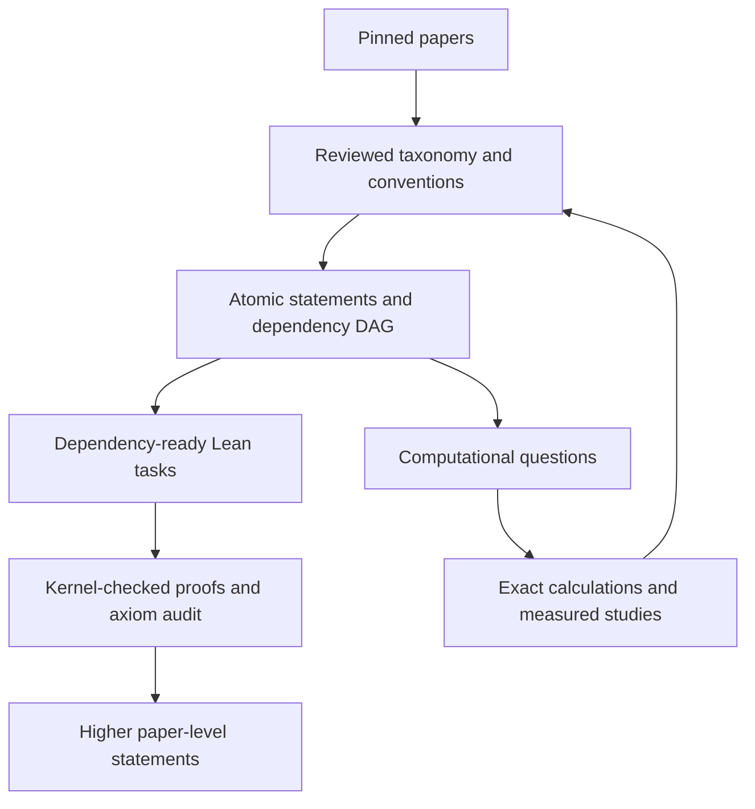

# Riemannian Fluids

Riemannian Fluids is an in-progress research library for understanding Professor Magdalena Czubak's research program on incompressible viscous flow on Riemannian manifolds through formal and computational implementation.

The long-term goal is to formalize the complete research program represented by the literature and to build computational tools that make its constructions, examples, and modeling choices executable. The repository is therefore both a mathematical implementation and a way to study the mathematics in another medium.

This is an independent research software project organized around published work by Professor Czubak and her collaborators. The papers remain the authority for their results; the repository records exactly which source statements, project specializations, formal proofs, symbolic calculations, and numerical studies have been implemented.

## The research program

A recurring question is how geometry determines the viscous term in incompressible flow. On flat space, familiar vector Laplacians can agree after incompressibility is imposed. On a curved manifold, the rough, Hodge, and deformation constructions can differ by Ricci, divergence, topology, embedding, and boundary terms:

```math
L_{\mathrm{rough}}=\nabla^{*}\nabla,
\qquad
L_{\mathrm{Hodge}}=d d^{*}+d^{*}d,
\qquad
L_{\mathrm{Def}}=2\,\mathrm{Def}^{*}\mathrm{Def}.
```

The broader program asks how these operators are constructed, compared, and selected by intrinsic kinematics, ambient restriction, wall laws, thin-domain limits, and the analytic setting of the flow. It also studies the function spaces, weak equations, pressure recovery, harmonic sectors, and compactness arguments needed for stationary and evolving Navier-Stokes equations on compact, noncompact, and negatively curved manifolds.

[`docs/literature.md`](docs/literature.md) explains how the pinned papers form three connected threads: intrinsic viscosity and curvature, kinematic and boundary selection, and noncompact hyperbolic flow.

## Implementation as mathematical inquiry

The repository develops one mathematical program in two implementation media:

- **Lean** makes definitions, hypotheses, theorem statements, and proof dependencies explicit. A checked proof certifies the exact proposition represented by its type.
- **Python** organizes exact calculations, reusable geometric functions, solver workflows, and physical or numerical examples. It makes choices of geometry, viscosity operator, wall law, discretization, observable, and acceptance criterion inspectable.
- **Literature and claim maps** connect both implementations to pinned source versions, conventions, and source locations without treating one kind of evidence as another.

The resulting definitions, dependency maps, proofs, failed specifications, examples, and executable studies form a collection of software artifacts through which the mathematical hierarchy can be read and studied. Complete understanding is not assumed at the outset; it develops alongside the implementation.

## AI-assisted autoformalization

AI agents are used to scale decomposition and proof development, not to replace source interpretation or mathematical review. The working process is:

1. **Map the papers.** Independent readings extract terminology, conventions, hypotheses, conclusions, examples, and ambiguous passages.
2. **Reconcile a formal specification.** Candidate readings are compared against the source text. Human review governs the working interpretation, especially statement boundaries, sign conventions, and mathematical scope.
3. **Build a statement DAG.** Each conclusion becomes an atomic formal obligation with explicit hypotheses and edges to the definitions and results it depends on.
4. **Work from the ready frontier.** Agent effort is allocated to dependency-ready nodes and shared blockers. Independent leaves can be developed in parallel before the argument is assembled upward.
5. **Use Lean as a feedback signal.** The kernel accepts or rejects proof terms, and the axiom audit exposes assumptions. A successful node unlocks its dependents; a failure can send the proof, specification, or taxonomy back for revision.



Agent agreement proposes a specification. It is not a vote on mathematical truth. Source-faithfulness remains a separate review obligation, and kernel acceptance proves only the statement that was actually encoded.

## Reading the Lean codebase

The Lean import graph is a dependency map of the mathematics:

```text
lean/RiemannianFluids/
├── Geometry/ and Tensors/          manifolds, connections, curvature, fields, forms
├── FunctionSpaces/ and Analysis/  Sobolev and solenoidal spaces, compactness, operators
├── Operators/ and Viscosity/      rough, Hodge, deformation, Stokes, selection principles
├── PDE/                            weak flow, pressure, stationary and evolving equations
└── Literature/                     stable paper-scoped statements and proved results
```

The directory order expresses the argument's dependency structure. Geometry and tensor calculus support the analytic spaces; those layers support fluid operators and weak equations; paper-scoped declarations sit at the top and reuse the common infrastructure below. A missing bridge in this graph identifies a mathematical obligation rather than merely a missing software feature.

Representative formal progress includes:

- constructed rough, Hodge, and deformation operators, their curvature comparisons, and a concrete hyperbolic witness separating the candidates;
- source-scoped vertical slices for the CCD17 comparison, the CZ24 operator census, the CCF25 sphere collapse, and the canonical hyperbolic specialization of CCP25;
- a reusable submanifold geometry and differential-operator layer for the CCG25 Gauss formulas; and
- weighted thin-shell carriers, operator interfaces, and exact smooth-core recovery constructions toward the WBS26 convergence theorem.

[`lean/README.md`](lean/README.md) gives the mathematical reading order, explains the meaning of different declaration kinds, and documents the formal trust boundary.

## Reading the Python codebase

The Python package separates mathematical meaning, computational realization, and evidence:

```text
python/
├── riemannian_fluids/
│   ├── geometry/, tensors/, operators/, function_spaces/, shells/  mathematical models
│   ├── symbolic/, discretization/, solvers/                         computational methods
│   └── validation/                                                  evidence records and gates
├── experiments/                                                     parameterized research studies
├── reproductions/                                                   source-linked adapters
├── examples/                                                        focused calculations
└── tests/                                                           mathematical and software checks
```

This organization keeps consequential choices visible. A comparison can change the manifold, viscosity construction, wall condition, backend, measured quantity, or tolerance without hiding that change inside a monolithic simulator.

The current workbench includes:

- exact SymPy geometry, operator identities, energy-integral solvers, series expansions, and thin-shell recovery certificates;
- vector-spherical-harmonic references and JAX stationary, nonlinear, and transient constrained solvers;
- FEniCSx surface Stokes and resolved three-dimensional shell discretizations; and
- report-producing studies for surface viscosity, thin shells, wall-selected operators, manufactured solutions, and mesh refinement.

These paths answer different questions. Exact symbolic identities do not establish a PDE existence theorem, and a convergent discrete study does not establish a continuous thin-domain limit. [`python/README.md`](python/README.md) documents the implemented models and studies; [`docs/computational-architecture.md`](docs/computational-architecture.md) records the backend capability boundaries.

## Evidence and status

The repository keeps several kinds of result distinct:

| Record | What it establishes |
| --- | --- |
| Lean theorem | a proposition follows from the hypotheses displayed in its type |
| source signature | the intended source-scoped proposition has been specified, but may remain unproved |
| project theorem or specialization | an exact result at the narrower scope stated by the project |
| symbolic certificate | an exact calculation or constructive witness in its declared domain |
| discrete solve or refinement study | measured behavior of an explicit finite-dimensional model |

Shared claim IDs connect these records to source versions and conventions. They do not collapse them into a single completion percentage. [`claims/README.md`](claims/README.md) documents the ledgers and status vocabulary, while [`docs/roadmap.md`](docs/roadmap.md) is the canonical account of completed slices, active integration work, and open theorem-sized goals.

The main open fronts are the paper-level integration of the CCG25 submanifold formulas, the full WBS26 Mosco and operator-convergence argument, the hyperbolic flow theorems built on the completed Hodge foundation, and broader computational tests across geometries, modes, and wall laws.

## Repository map

| Directory | Role |
| --- | --- |
| [`lean/`](lean/) | formal definitions, constructions, theorem statements, and proofs |
| [`python/`](python/) | exact computation, geometric models, solvers, and studies |
| [`claims/`](claims/) | source claims, atomic obligations, crosswalks, and evidence status |
| [`literature/`](literature/) | version-pinned source material and retrieval metadata |
| [`docs/`](docs/) | mathematical exposition, architecture, and roadmap |
| [`tools/`](tools/) | provenance, ledger, and trust-boundary validation |

## Getting started

[Pixi](https://pixi.sh/) supplies the locked Python, JAX, DOLFINx, PETSc, MPI, and validation environment. Lean and Mathlib are pinned separately under [`lean/`](lean/).

```sh
pixi install --locked
make lean/sync
make check
```

Focused validation commands are available when developing one layer:

```sh
make lean/check
make python/check
make claims/check
```

Several computational paths can also be run directly:

```sh
pixi run --locked symbolic-examples
pixi run --locked surface-viscosity
pixi run --locked surface-stokes
pixi run --locked wall-selection
```

`make check` validates the claim ledgers, builds and audits the Lean library, runs Python lint and tests, executes the literature adapters, and runs the reference and finite-element studies.

## Documentation

- [`docs/roadmap.md`](docs/roadmap.md): the sequenced formalization program and current theorem-sized frontiers.
- [`docs/claim-to-proof.md`](docs/claim-to-proof.md): the dependency graph from research questions to formal layers and paper statements.
- [`docs/literature.md`](docs/literature.md): the literature program, source IDs, and implementation status by paper.
- [`lean/README.md`](lean/README.md): the Lean architecture, reading order, conventions, and axiom policy.
- [`python/README.md`](python/README.md): the computational package, backends, studies, and active validation targets.
- [`docs/computational-architecture.md`](docs/computational-architecture.md): the shared flow contract and backend capability boundaries.
- [`docs/symbolic-backend.md`](docs/symbolic-backend.md): exact symbolic integration and thin-shell machinery.
- [`docs/thin-shell-convergence.md`](docs/thin-shell-convergence.md): computational evidence and remaining analytic obligations for wall selection.
- [`claims/README.md`](claims/README.md): claim classification, formal crosswalks, and evidence status.

## Contributing

Contributions should make their mathematical and evidentiary role explicit. A new definition, proof, computation, or experiment should identify:

1. the source question or downstream theorem it serves;
2. the mathematical layer that owns it;
3. its geometry, regularity, sign, and boundary conventions;
4. whether it is a formal theorem, specification, project result, symbolic certificate, or numerical study; and
5. the command or theorem that checks the result.

Reusable mathematics belongs below the paper namespaces. Paper-specific entry points belong under `RiemannianFluids.Literature.<paper>`, with their source relationship recorded in the claims crosswalk. Computational additions should keep models, methods, and evidence gates separate.

Before opening a pull request, run the focused checks for the affected layer and, when practical, the full `make check` gate.

## Sources and attribution

[`literature/manifest.json`](literature/manifest.json) records the canonical sources, retrieval URLs, versions, page counts, and SHA-256 digests used by the project. The archived papers retain their authors' and publishers' copyright and licensing terms and are not relicensed by this repository.
