# Riemannian Fluids

Riemannian Fluids is a research library for incompressible viscous flow on Riemannian manifolds.  It develops the geometric operators, function spaces, weak equations, and limiting arguments that give the Navier--Stokes equations their meaning on curved spaces.

The scientific program has four parts:

1. construct covariant differential operators on vector fields and differential forms;
2. compare the rough, Hodge, and deformation viscosity operators through curvature identities;
3. derive surface operators from intrinsic kinematics, ambient restriction, boundary laws, and thin-domain limits; and
4. formulate stationary and evolving incompressible flow on compact, noncompact, and negatively curved manifolds.

```mermaid
flowchart TD
  subgraph selection [operator selection]
    A[geometry and smooth tensors] --> B[intrinsic differential operators]
    B --> C[viscosity comparison and selection]
    C --> D[function spaces and weak formulations]
    D --> E[stationary and evolving Navier-Stokes equations]
  end
  subgraph shells [thin domains]
    F[submanifold and tubular geometry] --> G[boundary-selected operators]
    G --> H[quadratic forms on thin domains]
    H --> I[variational and operator convergence]
  end
  subgraph noncompact [noncompact geometry]
    J[Hodge structure] --> K[harmonic sectors and solenoidal closures]
    K --> L[hyperbolic Stokes and Navier-Stokes phenomena]
  end
```



## Lean & Python

The repository is organized as the **Czubak Formal Corpus**: a versioned program to formalize the key mathematical claims across Magdalena Czubak's literature on shared, reusable proof infrastructure. The present `geometric-fluids-v1` release boundary contains eleven pinned papers, 26 classified registry claims, and 42 atomic formal proof units after compound claims are split; it is the first release, not yet the complete publication corpus.

The repository contains a formal implementation in [Lean](lean/) and a computational implementation in [Python](python/), sharing mathematical conventions and literature provenance.  The two answer different scientific questions: Lean establishes logical consequences of explicit hypotheses, and Python establishes measured behavior of explicit models and discretizations.  A version-pinned [literature archive](literature/) supplies the source mathematics, and the [claims registry](claims/) keeps both forms of evidence attached to the same source conventions. [`claims/corpus.json`](claims/corpus.json) mechanically separates source results, source specializations, project theorems, heuristics, and computational gates.

The global-analysis foundation includes the complete measured Poincare half-plane, actual scalar and intrinsic one-form `L²` quotient Hilbert spaces, closed de Rham and covariant operators, the source-normalized one-form `H¹` completion, concrete `H¹` and `L²` Hodge sectors, the Leray projector, and a densely defined closed nonnegative self-adjoint Hodge--Stokes operator with harmonic kernel. The shifted complete-manifold energy theorem identifies the source `H¹` harmonic remainder with the full distributional harmonic `L²` sector, supplies the canonical harmonic `L² -> H¹` representative and exact norm, and completes the `N=2`, `k=1`, `a=1` CCP25 specialization. A continuous linear equivalence also identifies the independently constructed Stokes form domain with the full source divergence-free `H¹` carrier.

The thin-shell campaign now has its first theorem-sized constructive result: on the canonical torus, every smooth solenoidal stream-plus-flux field has exact three-dimensional recoveries at both the Navier and Hodge endpoints, with impermeability, exact solenoidality, native wall traces, exact normalized transverse identification, strong recovery, and the source-scoped quadratic energy rate. Those formulas are now connected to actual thickness-dependent weighted `L²` quotient carriers and uniformly bounded lift/flux-identification operators. The remaining WBS26 work is the closed solenoidal endpoint forms, full Mosco convergence, and the associated operator consequences recorded in the corpus roadmap.

## Layout

| Directory | Contents |
| --- | --- |
| [`lean/`](lean/) | formal definitions, constructions, and proofs |
| [`python/`](python/) | executable geometry, operators, solvers, and studies |
| [`claims/`](claims/) | source claims and evidence status |
| [`literature/`](literature/) | version-pinned papers and retrieval metadata |
| [`docs/`](docs/) | mathematical exposition and research architecture |
| [`tools/`](tools/) | provenance and trust-boundary validation |

## Getting started

Pixi is the development environment and task runner; its single locked environment contains JAX, DOLFINx, PETSc, MPI, and the validation tools.  The formal library builds through `lake`.

```sh
pixi install --locked
make lean/sync
make check
```

`make check` builds and audits the formal library, runs static analysis and tests, executes the reference and finite-element studies, and verifies the claim ledgers.  `make lean/check`, `make python/check`, and `make claims/check` run the pieces separately.

## Documentation

- [`docs/roadmap.md`](docs/roadmap.md): the sequenced research program, evidence boundaries, and completion gates.
- [`lean/README.md`](lean/README.md): the formal development and its mathematical reading order.
- [`docs/formal-analysis.md`](docs/formal-analysis.md): notation, conventions, semantic roles of Lean declarations, and the axiom-audit policy.
- [`python/README.md`](python/README.md): the Python package, its backends, and the executable studies.
- [`docs/computational-architecture.md`](docs/computational-architecture.md): backend boundaries, the shared flow contract, and numerical evidence gates.
- [`docs/symbolic-backend.md`](docs/symbolic-backend.md): the exact SymPy solvers for energy integrals and thin-shell limits.
- [`docs/thin-shell-convergence.md`](docs/thin-shell-convergence.md): wall-selection experiments and the analytic obligations for Mosco convergence.
- [`docs/claim-to-proof.md`](docs/claim-to-proof.md): the dependency structure from research questions to formal milestones.
- [`docs/literature.md`](docs/literature.md): how the pinned sources form a common research program.
- [`claims/README.md`](claims/README.md): corpus classification, claim IDs, evidence classes, and formal status.
