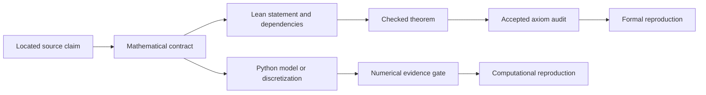
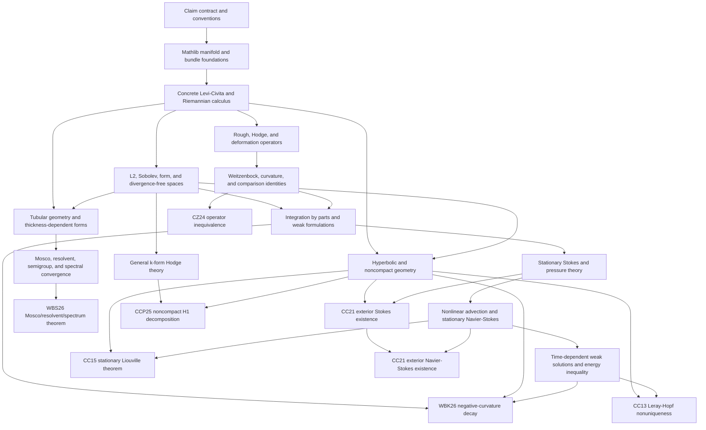

# From literature claims to checked proofs

Riemannian Fluids exists to answer a specific class of questions: which geometric operators and analytic structures actually govern incompressible flow on a Riemannian surface, and which conclusions in the literature can be reproduced with evidence appropriate to the claim?

This is not a general-purpose differential-geometry library and it is not a numerical demonstration gallery. The unit of work is a located claim in a source paper. Reusable geometry, analysis, and computation are developed when they are prerequisites for such a claim.

This document records logical dependencies. It is not a schedule. A later rung cannot discharge the hypotheses of an earlier one, but independent branches may advance at different rates.

The companion [`formal-analysis.md`](formal-analysis.md) explains how these dependencies appear in Lean declarations and how to read the tactic-level comments as an expository formal proof.

## The central question is not “which Laplacian?”

There is no context-free vector Laplacian on a curved manifold that should be chosen once and hidden behind a default. The rough/Bochner, Hodge, and deformation operators arise from different constructions. Curvature, incompressibility, topology, boundary conditions, and the mechanism by which a surface model is derived can make them agree, differ by an explicit correction, or select one of them physically.

The project therefore separates three questions:

1. **Construction:** what is each operator on the stated geometric and functional domain?
2. **Comparison:** under which hypotheses are two formulations related, and what is the correction term when they are not?
3. **Selection:** does a variational principle, energy law, relativistic limit, wall law, or thin-domain limit select one operator for a particular model?

A “decision” about the Laplacian is consequently a theorem with assumptions, not a repository setting.

## What reproduction means

Every paper claim begins in [`claims/registry.json`](../claims/registry.json) with a source version, locator, statement, assumptions, convention, evidence class, and acceptance status. The two implementations then have different jobs:

The branches share provenance and conventions, not epistemic force. A pointwise residual, manufactured solution, or convergence study may expose a bad statement or sign convention; it cannot prove an analytic theorem. Conversely, a formal identity does not establish that a discretization converges to the intended PDE.

The formal states in [`claims/formalization.json`](../claims/formalization.json) mean:

- **catalogued:** the analytic claim is known, but no checked Lean statement is yet attached;
- **contract-checked:** the source-faithful theorem statement, assumptions, and conventions have been reviewed;
- **interface-proved:** the conclusion has been proved from explicit abstract hypotheses, but the project has not yet constructed or discharged all of those hypotheses for the source setting;
- **formally-reproduced:** the concrete source theorem is checked and its axiom audit is accepted.

An abstract energy lemma can therefore be valuable without being mislabeled as a reproduction of an existence, uniqueness, decay, or convergence theorem.

## Reusable proof architecture

The graph below shows the mathematical dependencies shared by the registered analytic claims. An arrow means “must supply definitions or theorems used by,” not merely “is conceptually related to.”

The graph deliberately has branches. Thin-shell convergence does not depend on first proving nonlinear Navier--Stokes existence, while hyperbolic nonuniqueness does. General \(k\)-form infrastructure is included because `CCP25-h1-noncompact-decomposition` requires it, not because the repository is quietly expanding into unrestricted differential geometry.

## The dependency order

### Lock the claim before proving it

The source version, theorem locator, hypotheses, sign convention, geometric dimension, boundary behavior, and evidence class must be explicit. This is where an informal phrase such as “the Hodge Laplacian” becomes a typed mathematical contract. Without this rung, later formal work can be correct but prove the wrong theorem.

### Cross the Mathlib boundary once

Mathlib supplies manifolds, tangent bundles, Riemannian bundles, and covariant derivative infrastructure. This project should add only the constructions needed by its claims: initially intrinsic two-dimensional surfaces, a concrete Levi-Civita connection, musical maps, curvature contractions, gradient, divergence, deformation, and covariant advection.

The present Lean code now exposes regularity-indexed bundled sections, a metric-compatible torsion-free tangent-connection *witness*, and covariant differentiation as a linear operator $C^{k+1}(TM) \to C^k(\operatorname{Hom}(TM,TM))$. It also constructs smooth metric musical equivalences, the scalar differential and gradient, coordinate-invariant fiberwise trace, intrinsic divergence, the lowered tensor $(X,Y) \mapsto g(\nabla_Xu,Y)$, coordinate-natural transposition, and the concrete deformation tensor $\operatorname{Def}u$. The regularity loss is visible in each first-order operator. The inverse musical map, fiberwise trace, and tensor transpose have coordinate proofs: smooth metric inversion, trace invariance under conjugation, and naturality under the induced tangent/cotangent coordinate changes are proved rather than assumed.

These constructions use mathlib's native covariant derivative, connection-regularity, and torsion APIs. A localized compatibility predicate records the tangent specialization of mathlib's metric-derivative identity because the pinned mathlib version has incompatible tangent-fiber instance paths for the generic bundled predicate.

Existence and uniqueness of the Levi-Civita connection, the equivalence of the localized metric predicate with the generic predicate once that instance issue is resolved, and the remaining curvature and formal-adjoint calculus are still obligations. The one-form codifferential $d^*\alpha = -\operatorname{div}(\alpha^\sharp)$ and its exact correction $d d^*$ are concrete. Positive-degree exterior differentiation, degree-two codifferentiation, curvature contraction to Ricci, and the realization of $2\operatorname{Def}^*\operatorname{Def}$ are explicit data boundaries. They must be constructed before the comparison identity becomes a concrete theorem about Riemannian surfaces.

### Construct the operators before comparing them

The rough, Hodge, and deformation operators must be defined on an explicit class of smooth fields or one-forms with the analysis-positive signs fixed in [`RiemannianFluids.Conventions`](../lean/RiemannianFluids/Conventions.lean). Only then should the library prove Weitzenböck, Ricci, grad-div, and symmetric gradient identities.

This rung is the mathematical center of the operator-choice problem. It must preserve correction terms until hypotheses such as incompressibility or a boundary condition make them vanish.

### State the PDE on its real function spaces

Paper theorems concern \(L^2\), \(H^1\), \(H^1_0\), divergence-free closures, weak derivatives, and differential forms—not an arbitrary inner-product space. These spaces, their density results, trace or decay conditions, and the relevant integration-by-parts theorems must be present before positivity, coercivity, or pressure cancellation has the meaning used in the papers.

The existing `ScalarVectorCalculus` and `EnergyConservingAdvection` structures package the identities needed downstream. They are interfaces to be realized, not substitutes for this rung.

Those interfaces live in `RiemannianFluids.Analysis.AbstractEnergy`. This module boundary makes the gap between a proved abstract consequence and a constructed geometric operator explicit in the code.

### Establish the linear Stokes problem first

Weak Stokes theory isolates the elliptic operator, incompressibility constraint, pressure gauge, kernel or Killing fields, and boundary conditions. Coercivity, inf-sup or de Rham pressure results, and domain-specific existence belong here. This rung supports the exterior-domain Stokes claim and supplies the linear estimates used in nonlinear arguments.

### Add nonlinearity, then evolution

Covariant advection must be shown to act on the chosen spaces and to satisfy the appropriate trilinear estimates and cancellation identities. Stationary Navier--Stokes arguments can then build on Stokes theory. Time-dependent Leray-Hopf theory additionally requires Bochner spaces, weak time derivatives, Galerkin or compactness machinery, and an energy inequality.

The current Lean theorem proves an instantaneous energy identity from abstract hypotheses. It does not yet supply a trajectory, a weak solution, or the compactness argument needed by the hyperbolic claims.

### Specialize to noncompact, form, or thin-shell settings only when needed

Hyperbolic papers require noncompact Sobolev spaces, cutoffs, harmonic fields, exterior domains, and curvature-sensitive estimates. The CCP25 claim requires general \(k\)-forms and noncompact Hodge decomposition. The WBS26 claim instead requires tubular geometry, two-wall quadratic forms, transverse averaging, and variational convergence.

These are claim-driven branches. They should reuse the core without forcing surface APIs to pretend they already support arbitrary dimension, arbitrary codimension, or every boundary regime.

## Analytic claims and their proof routes

All eight analytic claims are currently `catalogued`. The table describes what would have to exist before changing that status; it does not assert that the listed paper theorem has already been formalized.

| Claim | Route through the graph | Formal completion requires |
| --- | --- | --- |
| `CZ24-operator-census` | Concrete Riemannian calculus → operator constructions → comparison identities | Concrete candidate operators and a source-faithful proof of inequivalence or an explicit curved witness, with conventions reconciled. |
| `WBK26-negative-curvature-decay` | Operator identities and weak spaces → weak Navier–Stokes evolution on hyperbolic geometry | The weak deformation-viscosity equation, negative-curvature coercivity, a valid energy inequality, and the exponential decay argument. |
| `WBS26-mosco-resolvent-spectrum` | Riemannian and tubular geometry → thickness-dependent forms → variational convergence | Thickness-dependent closed forms, liminf and recovery-sequence proofs, then justified resolvent, semigroup, and spectral consequences. |
| `CC13-leray-hopf-nonuniqueness` | Weak function spaces → Navier–Stokes evolution on the hyperbolic plane | The stated hyperbolic model, admissible harmonic-field construction, Leray-Hopf solutions, energy inequality, and distinctness proof. |
| `CC15-stationary-liouville` | Weak stationary Navier–Stokes theory → noncompact hyperbolic estimates | The paper's finite-Dirichlet class, noncompact cutoff and integration arguments, and the exact Liouville conclusion under its stated hypotheses. |
| `CC21-nontrivial-stokes-exterior` | Weak Stokes and pressure theory → hyperbolic exterior domains | The hyperbolic exterior domain, \(H^1_0\) setting, pressure treatment, nonzero construction, and verification of the steady Stokes equations. |
| `CC21-nontrivial-navier-stokes-exterior` | Exterior-domain Stokes existence → stationary nonlinear theory | The nonlinear correction or fixed-point argument, estimates keeping it in the claimed space, and proof that the resulting steady solution is nontrivial. |
| `CCP25-h1-noncompact-decomposition` | Sobolev spaces of forms → noncompact Hodge theory | The paper's \(H^1\) spaces of \(k\)-forms, exact/coexact/harmonic summands, closedness and orthogonality results, and the noncompact space-form theorem. |

Claim-specific final statements should live under a future `RiemannianFluids.Reproductions` namespace mirroring `python/reproductions/`. Reusable geometry and analysis remain in their domain modules. This keeps a paper theorem traceable without burying reusable mathematics inside a paper adapter.

## The first coherent formal slice

The most informative first vertical slice is the registered identity `CCD17-divfree-def-hodge`, even though its current evidence class is a validated pointwise identity rather than an analytic-theorem gate. It sits directly on the route to the Laplacian-selection claims and forces the foundational layers to become concrete.

That slice consists of:

1. regularity-indexed vector fields and one-forms on a Riemannian surface, followed by the still-missing orientation infrastructure needed by the form branch;
2. musical equivalences, divergence, deformation, and the rough and Hodge Laplacians with fixed signs;
3. the required Weitzenböck and symmetric-gradient identities;
4. specialization to divergence-free fields;
5. the source-convention statement \(L_{\mathrm{Def}} = L_{\mathrm{Hodge}} - 2\operatorname{Ric}\);
6. an axiom audit of the final declaration.

The current formal milestone supplies the musical equivalence, scalar differential and gradient, regularity-losing covariant derivative, smooth fiberwise trace, intrinsic divergence, and a concrete divergence-free predicate. It also supplies coordinate-natural transposition and symmetrization of covariant two-tensors and therefore the pointwise formula $\operatorname{Def}(u)(X,Y) = \frac12\bigl(g(\nabla_Xu,Y) + g(\nabla_Yu,X)\bigr)$.

On the form branch, the implementation proves $d^*(u^\flat) = -\operatorname{div}u$, constructs the regularity-losing exact correction $(d d^*(u^\flat))^\sharp$, and proves that this correction vanishes for the intrinsic divergence-free predicate. The Hodge Laplacian is then assembled as $d d^* + d^* d$ from explicit degree-one exterior derivative and degree-two codifferential data. On the curvature branch, a smooth Ricci endomorphism acts pointwise on vector fields, while its construction by contracting Riemann curvature remains an explicit input.

`RiemannianFluids.Operators.GeometricIdentities` separately names the analysis-positive Weitzenböck identity $\nabla^*\nabla = L_{\mathrm{Hodge}} - \operatorname{Ric}$ and symmetric-gradient identity $L_{\mathrm{Def}} = \nabla^*\nabla + d d^* - \operatorname{Ric}$. From those visible hypotheses it proves the full translation of [CCD17 equation (1.3)](https://arxiv.org/abs/1608.05114), $L_{\mathrm{Def}} = L_{\mathrm{Hodge}} + d d^* - 2\operatorname{Ric}$, and the theorem `ccd17_divfree_def_hodge`, whose conclusion is $L_{\mathrm{Def}}u = L_{\mathrm{Hodge}}u - 2\operatorname{Ric}(u)$ for divergence-free $u$.

This is an interface proof, not yet a formal reproduction: the pinned mathlib version does not supply the required positive-degree de Rham, Riemann/Ricci, or formal-adjoint infrastructure, and the two comparison identities are still hypotheses. No registered claim changes formalization status at this milestone.

The existing Python residual tests remain the computational companion to this theorem. Agreement between the two branches is evidence that they implement the same statement; the numerical residual is not used as a premise in Lean.

This slice unlocks meaningful formal work on operator inequivalence, curvature coercivity, energy decay, and thin-shell selection without prematurely taking on a full weak Navier--Stokes existence theory.

## How new work fits the repository

A contribution should be understandable through the following questions:

1. Which registered claim or reusable dependency does it serve?
2. Which mathematical layer owns the definition or theorem?
3. Which assumptions and sign conventions are visible in its statement?
4. Is its evidence formal, symbolic, manufactured, discrete, or convergent?
5. What exact declaration or acceptance test would justify changing status?

If those answers are absent, the work may still be interesting mathematics or software, but it is not yet integrated into the reproduction program.
