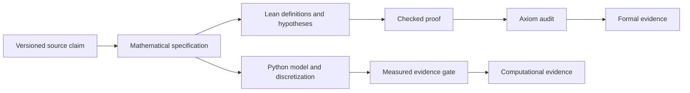
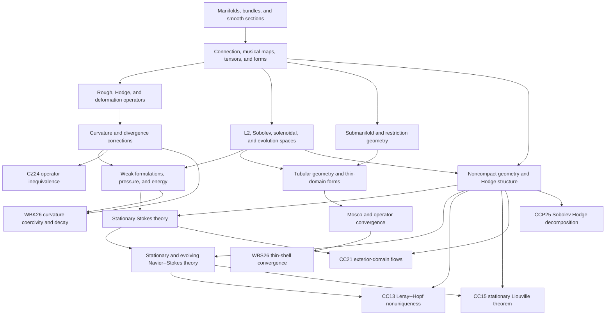

# From research questions to formal theorems

The formal program studies how Riemannian geometry determines the operators, spaces, and estimates of incompressible viscous flow.  Literature claims identify decisive mathematical phenomena.  Shared formal layers make the mechanisms behind those phenomena explicit and reusable.

## Construction, comparison, and selection

Every viscosity result belongs to one or more of three tasks.

1. **Construction:** define an operator on a specified geometric and functional domain.
2. **Comparison:** derive the curvature, divergence, topology, or boundary correction relating two operators.
3. **Selection:** prove that kinematics, an energy principle, an ambient restriction, a wall law, or a limiting process produces a particular operator.

The rough, Hodge, and deformation operators therefore remain individually named throughout the library.  A theorem records every equality or selection principle and its hypotheses.

## Formal and computational evidence

Formal evidence certifies logical consequence.  Computational evidence certifies a measured property of an explicit model or discretization.  Shared claim IDs, assumptions, and conventions connect the two branches.

## Shared dependency graph

## Formal layers

### Geometric calculus

This layer supplies regularity-indexed fields, covariant differentiation, metric duality, gradient, divergence, tensor symmetry, deformation strain, curvature data, and differential forms.  Coordinate naturality and regularity loss are theorem-level properties.

### Intrinsic viscosity

This layer constructs and compares the rough, Hodge, and deformation operators.  Weitzenbock, Ricci, grad-div, and symmetric-gradient identities determine their relationships.  Incompressibility removes the exact codifferential correction.

### Function spaces and weak equations

This layer supplies \(L^2\), Sobolev, solenoidal, harmonic, and evolution structures; integration-by-parts principles; pressure recovery; weak Stokes equations; and weak Navier--Stokes equations.  Coercivity, density, compactness, and trace theorems attach the abstract equations to a source setting.

### Submanifolds and thin domains

This layer supplies immersions, tangent/normal splittings, second fundamental forms, shape operators, ambient restriction, tubular coordinates, wall profiles, transverse averaging, and varying quadratic forms.  Mosco convergence connects thin-domain energies to surface operators; resolvent, semigroup, and spectral results follow through operator theory.

### Noncompact and hyperbolic analysis

This layer supplies bounded geometry, cutoffs, harmonic fields, real-analytic local structure, exhaustion compactness, exterior domains, and noncompact Hodge decomposition.  These ingredients determine the energy spaces and asymptotic estimates used by the hyperbolic flow theorems.

## Analytic theorem targets

The analytic-status ledger currently records eight `catalogued` source theorems.

| Claim | Formal route | Completion milestone |
| --- | --- | --- |
| `CZ24-operator-census` | concrete operators → comparison identities → curved witness | construct a source-faithful curved divergence-free witness and prove candidate inequivalence |
| `WBK26-negative-curvature-decay` | deformation viscosity → hyperbolic coercivity → weak evolution | construct the weak solution framework, energy inequality, uniqueness estimate, and exponential decay |
| `WBS26-mosco-resolvent-spectrum` | tubular geometry → varying forms → Mosco convergence | prove liminf and recovery theorems and derive the scoped operator and spectral conclusions |
| `CC13-leray-hopf-nonuniqueness` | harmonic fields → solenoidal energy spaces → weak evolution | construct the hyperbolic solutions, verify the energy inequality, and prove distinctness |
| `CC15-stationary-liouville` | finite-Dirichlet space → cutoffs → stationary equation | formalize the noncompact integration argument and Liouville conclusion |
| `CC21-nontrivial-stokes-exterior` | exterior domain → weak Stokes and pressure | construct and verify a nonzero finite-energy Stokes solution |
| `CC21-nontrivial-navier-stokes-exterior` | exterior Stokes solution → nonlinear correction | formalize the fixed-point estimates and verify the stationary solution |
| `CCP25-h1-noncompact-decomposition` | Sobolev forms → exact/coexact/harmonic sectors | prove closedness, orthogonality, and decomposition on the stated space forms |

## The first vertical slice

`CCD17-divfree-def-hodge` is the first formal vertical slice because it connects smooth Riemannian calculus to a fluid-operator conclusion.

The slice contains:

1. smooth vector fields and one-forms;
2. musical maps and covariant differentiation;
3. divergence and deformation strain;
4. Hodge, rough, Ricci, and deformation operator data;
5. Weitzenbock and symmetric-gradient identities;
6. the full operator comparison; and
7. the divergence-free specialization.

The constructed portion includes musical equivalence, covariant differentiation, trace, divergence, tensor symmetry, `Def`, the one-form codifferential, and the vanishing exact correction.  The formal-adjoint and curvature constructions supply the next milestones toward an end-to-end source theorem.

## Integration contract for new work

Every addition states:

1. the mathematical layer that owns it;
2. the source question or downstream theorem it serves;
3. its geometric, analytic, and sign conventions;
4. its evidence class;
5. its formal or computational acceptance criterion; and
6. the declaration or experiment that exposes the result.

This contract keeps definitions reusable, claims traceable, and evidence scientifically interpretable.
