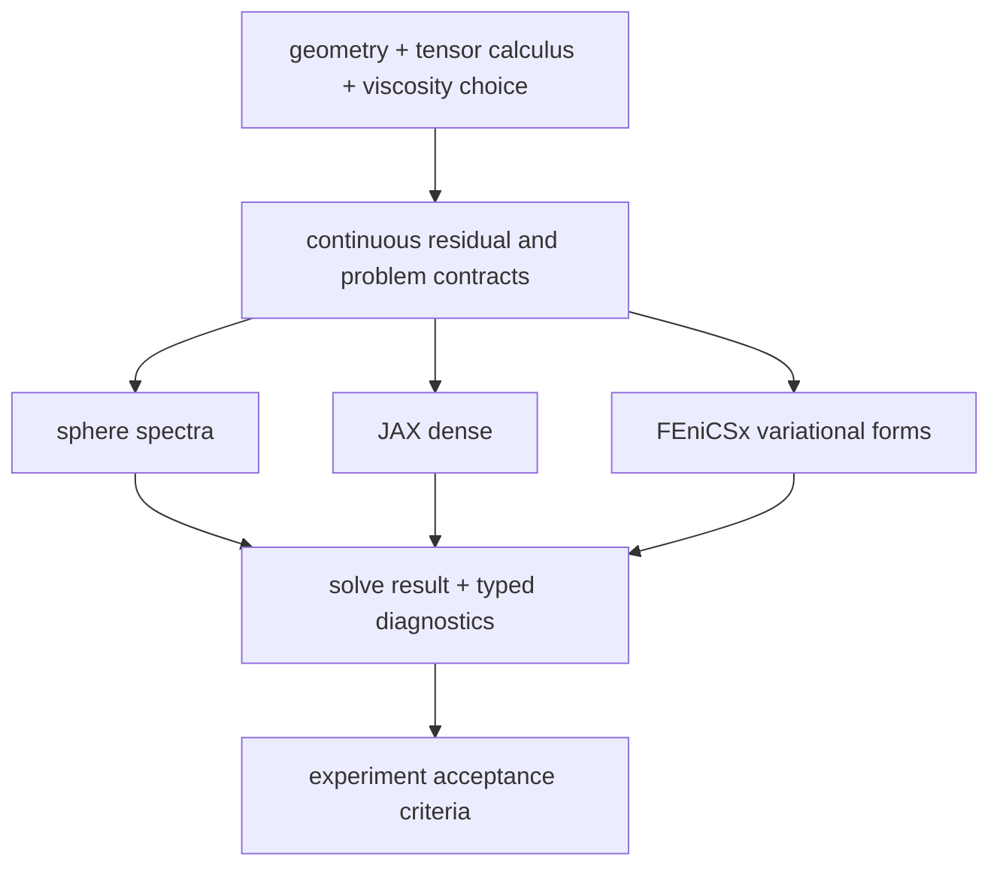

# Computational architecture

The executable implementation separates mathematical models, discretizations, solvers, and evidence.  A result is not promoted from one layer to another merely because the same equation name appears in both.

## Common semidiscrete contract

`SemiDiscreteFlowSystem` represents

\[
M \dot u + A u + N(u) + B^T p = f, \qquad Bu = g.
\]

It owns coefficient-space operators, forcing, the incompressibility constraint, the pressure gauge, and optional quadratic convection.  `FlowState`, `FlowSolveResult`, and `FlowDiagnostics` give stationary and transient solvers the same output vocabulary.  The historical `MixedStokesSystem` name remains a compatibility alias for the linear specialization.

The JAX dense backend provides a deliberately small reference realization: gauged mixed linear solves, automatic-Jacobian constrained Newton, and implicit Euler with an incompressibility solve at every step.  It is useful for testing algebraic contracts and solver behavior.  It is not a surface spatial discretization.

## Discretization roles

The spherical spectral backend is the exact global reference on the round sphere.  It exposes exact/coexact modes, viscosity eigenvalues, divergence, pressure recovery, and the deformation Killing kernel.

The FEniCSx surface backend is a spatial discretization.  It uses ambient three-component P2 velocity, P1 pressure, tangential differential operators, a normal-velocity penalty, and a pressure gauge on normalized octahedral sphere refinements.  The current vertical slice is resolvent-deformation Stokes; convection has not yet been lowered into this variational backend.

The FEniCSx shell backend is a volume discretization.  It tetrahedralizes independent radial layers between two sphere meshes and tags both walls.  It supports a no-slip manufactured problem and the Navier deformation, Hodge div--curl, and signed-curvature partial-slip forms.  Its transverse rotational projection is an operator-sensitive averaging observable, not a Mosco proof.

## Capability boundary

| Capability | Spherical spectral | JAX dense | FEniCSx surface | FEniCSx shell |
| --- | --- | --- | --- | --- |
| Exact global spherical Stokes reference | yes | no | compared against | no |
| Stationary nonlinear constrained solve | no | yes | not yet | not yet |
| Transient constrained solve | no | yes | not yet | not yet |
| Spatially resolved surface Stokes | no | no | yes | no |
| Resolved three-dimensional shell | no | no | no | yes |
| Navier/Hodge wall-selected shell resolvent | analytic reference | no | target operator only | one spherical mode |

## Evidence gates

`surface-stokes` requires decreasing velocity error against a known spherical mode and bounds divergence, normal leakage, and the pressure gauge.  `navier-stokes` requires manufactured state recovery, energy-neutral convection, constrained Newton convergence, transient incompressibility, and energy decay.  `resolved-shell` requires finite mixed diagnostics and decreasing velocity, curved-wall trace, and transverse-average errors under volume-mesh refinement; its thickness table also makes under-resolution visible through \(h/\varepsilon\).

`wall-selection` adds fixed-thickness mesh limits, a coupled constant-\(h/\varepsilon\) thin sequence, and exact spherical resolvent coefficients for the Navier, Hodge, and intermediate wall family.  The analytic obligations behind the corresponding continuous convergence theorem are tracked in [`thin-shell-convergence.md`](thin-shell-convergence.md).

These gates support the implemented discrete problems.  They do not replace the repository's analytic existence, uniqueness, Mosco, resolvent, semigroup, or spectral-convergence proofs.
